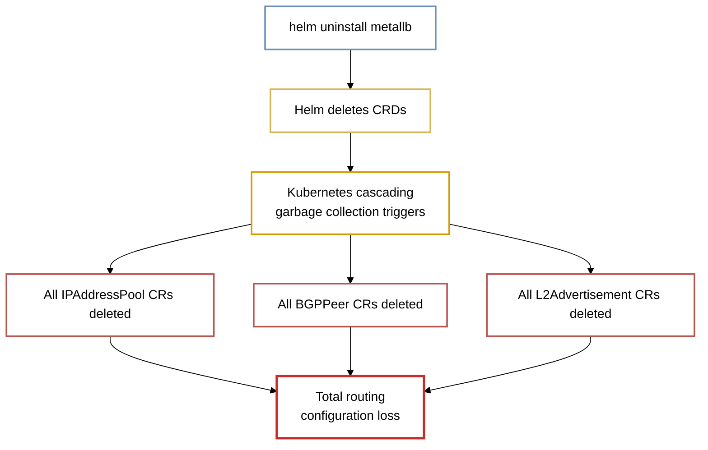
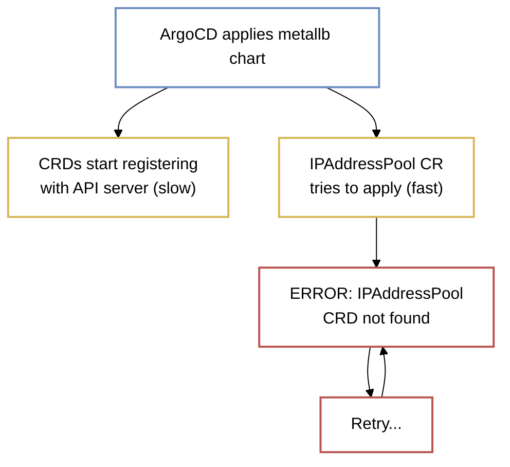
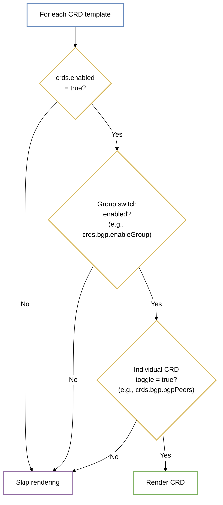
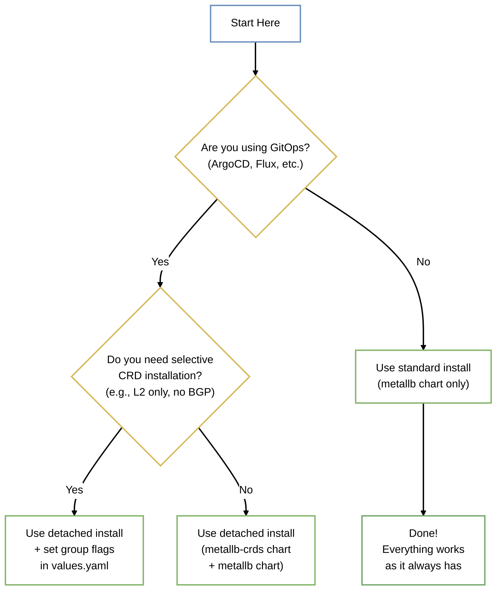
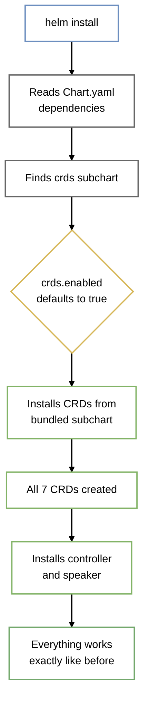
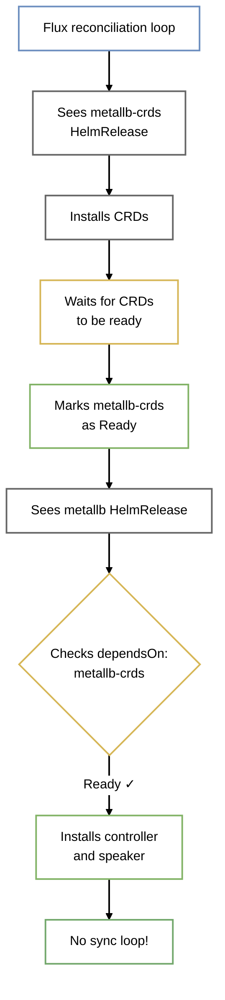
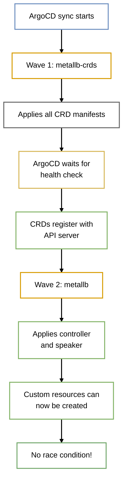
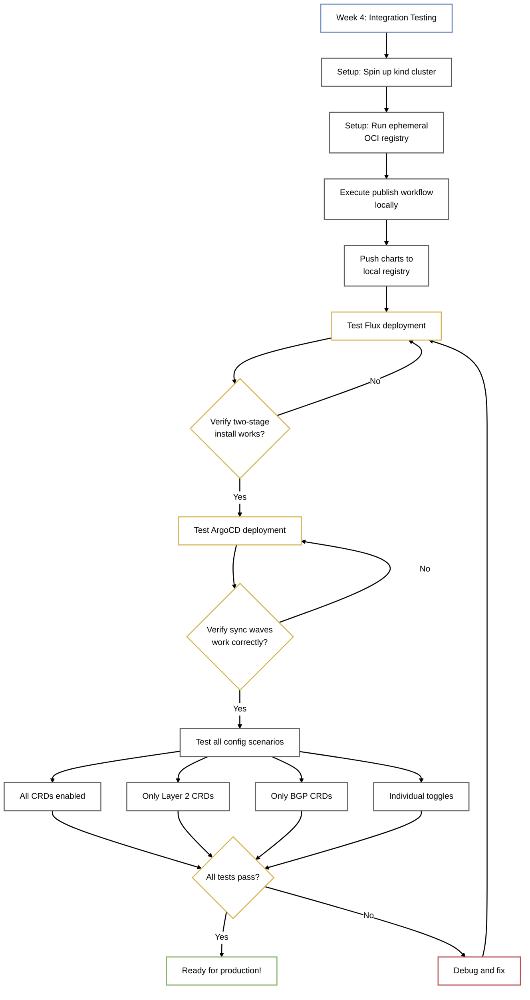

# Decoupling Helm CRDs for GitOps Compatibility

## Table of Contents

- [Summary](#summary)
- [Motivation](#motivation)
  - [Goals](#goals)
  - [Non-Goals](#non-goals)
- [Proposal](#proposal)
- [Design Details](#design-details)
  - [CRD File Structure](#crd-file-structure)
  - [Opt-Out Configuration](#opt-out-configuration)
  - [Backward Compatibility](#backward-compatibility)
  - [Helm Usage Commands](#helm-usage-commands)
- [Usage Examples](#usage-examples)
  - [Legacy CLI Install](#legacy-cli-install)
  - [Detached CLI Install](#detached-cli-install)
  - [Flux](#flux)
  - [ArgoCD](#argocd)
- [Risks and Mitigations](#risks-and-mitigations)
- [Implementation Plan](#implementation-plan)
  - [Phase 1: Local Development](#phase-1-local-development)
  - [Phase 2: CI/CD Pipeline Updates](#phase-2-cicd-pipeline-updates)
  - [Phase 3: Integration Testing](#phase-3-integration-testing)
- [Testing Plan](#testing-plan)
- [Drawbacks](#drawbacks)

## Summary
---

Split MetalLB's Custom Resource Definitions (CRDs) from the main Helm chart into a standalone chart. This prevents catastrophic configuration loss during uninstalls, fixes GitOps sync loops with ArgoCD and Flux, allows selective CRD installation (BGP or Layer 2 only), and follows the pattern used by prometheus-operator and other CNCF projects.

This proposal addresses [issue #2994](https://github.com/metallb/metallb/issues/2994). I'm working on this enhancement because it's something I'd like to see for my own GitOps setups.

**Author:** @AubbsDev21

## Motivation
---

Currently, MetalLB ships its CRDs and controller workloads within the same unified Helm chart. This creates several critical operational bottlenecks for infrastructure teams:

**Problem 1: Catastrophic Configuration Loss (Cascading Deletion)**

Because the CRD lifecycle is tied to the application controller, running `helm uninstall metallb` deletes the CRDs. This triggers Kubernetes cascading garbage collection, immediately wiping out all user-defined Custom Resources (e.g., `IPAddressPool`, `BGPPeer`), resulting in total routing configuration loss.



**Problem 2: GitOps Sync Failures (Issue #2994)**

When you deploy MetalLB with ArgoCD or Flux, both tools try to apply everything at once. The CRDs and the custom resources that depend on them hit the API server simultaneously. The API server hasn't finished registering the CRD schemas yet, so the custom resources get rejected. ArgoCD and Flux retry, hitting the same race condition over and over.



**Problem 3: API Server Overhead**

Bare-metal clusters operating strictly on Layer 2 routing are forced to install BGP and BFD related CRDs. This consumes unnecessary disk space in etcd and clutters the cluster API.

| CRD | Core | Layer 2 | BGP |
|-----|------|---------|-----|
| IPAddressPool | ✓ | - | - |
| Communities | ✓ | - | - |
| ConfigurationStates | ✓ | - | - |
| L2Advertisement | - | ✓ | - |
| ServiceL2Status | - | ✓ | - |
| BGPPeer | - | - | ✓ |
| BGPAdvertisement | - | - | ✓ |
| BFDProfile | - | - | ✓ |
| ServiceBGPStatus | - | - | ✓ |

**Problem 4: Version Control Friction**

Maintaining a monolithic `crds.yaml` file creates difficult-to-read Git diffs and increases the likelihood of merge conflicts during minor schema updates.

### Goals

- Enable two-stage deployment (CRDs first, then controller) for GitOps tools
- Split the monolithic CRD template into individual files, one per CRD
- Let users disable specific CRD groups (Layer 2, BGP) or individual CRDs via values
- Keep backward compatibility for `helm install metallb metallb/metallb`
- Prevent cascading deletion of user configuration during chart uninstalls

### Non-Goals

- Changes to controller code
- Modifications to CRD schemas themselves
- Automatic CRD upgrades (Helm's `--skip-crds` limitation still applies)

## Proposal
---


Create a `metallb-crds` subchart at `charts/metallb/charts/crds`. Bundle it with the main chart for legacy installs, but also publish it as a standalone artifact for GitOps users.

## Design Details
---


### CRD File Structure

Instead of one giant `crds.yaml` file with everything mashed together, we'll have individual files:

```
charts/crds/templates/
├── ipaddresspools.yaml          # Core: IP address range definitions
├── communities.yaml              # Core: BGP community tags
├── configurationstates.yaml      # Core: Configuration state tracking
├── l2advertisements.yaml         # Layer 2: ARP/NDP advertisement config
├── servicel2statuses.yaml        # Layer 2: Status reporting
├── bgppeers.yaml                 # BGP: Neighbor definitions
├── bgpadvertisements.yaml        # BGP: Route advertisement config
├── bfdprofiles.yaml              # BGP: Bidirectional Forwarding Detection
└── servicebgpstatuses.yaml       # BGP: Status reporting
```

Each file gets rendered independently based on the values configuration. This means:
- Git diffs only show the file that changed
- You can trace which CRD was modified in commit history
- Reviewers don't need to parse a 2000-line YAML concatenation

### Opt-Out Configuration

Everything is enabled by default. Users opt out of what they don't need:

```yaml
crds:
  # Master switch to enable/disable all CRD installation via Helm
  enabled: true
  
  core:
    # Enable core CRDs required by all MetalLB deployments
    enableGroup: true
    ipAddressPools: true
    communities: true
    configurationStates: true
  
  layer2:
    # Enable the CRD group specific to Layer 2 routing
    enableGroup: true
    l2Advertisements: true
    serviceL2Statuses: true
  
  bgp:
    # Enable the CRD group specific to BGP routing
    enableGroup: true
    bgpPeers: true
    bgpAdvertisements: true
    bfdProfiles: true
    serviceBgpStatuses: true
```

**How the template logic works:**



### Backward Compatibility

Standard Helm installs work unchanged. When you run `helm install metallb metallb/metallb`, Helm's dependency system automatically includes the `crds` subchart. The bundled CRDs are enabled by default (`crds.enabled: true`), so users get the exact same result as before this refactor.

### Helm Usage Commands

**Standard install (all-in-one):**
```bash
helm install metallb metallb/metallb
```

Everything installs together - CRDs, controller, and speaker. This is the simplest approach for users who don't need GitOps or selective CRD installation.

**Detached install (two-stage):**
```bash
# Step 1: Install CRDs first
helm install metallb-crds metallb/metallb-crds

# Step 2: Install controller and speaker, skip bundled CRDs
helm install metallb metallb/metallb --set crds.enabled=false
```

This gives you control over the CRD lifecycle independent from the application. Useful for:
- GitOps deployments (prevents sync loops)
- Managing CRD upgrades separately
- Testing new MetalLB versions without changing CRD schemas

**Selective CRD installation:**
```bash
# Layer 2 only (no BGP CRDs)
helm install metallb-crds metallb/metallb-crds --set bgp.enableGroup=false

# BGP only (no Layer 2 CRDs)
helm install metallb-crds metallb/metallb-crds --set layer2.enableGroup=false
```

### Which Installation Method Should You Use?



## Usage Examples
---


### Legacy CLI Install

Nothing changes for users who don't need GitOps:

```bash
helm repo add metallb https://metallb.github.io/metallb
helm install metallb metallb/metallb
```

What happens behind the scenes:



### Detached CLI Install

For users who want CRD lifecycle separate from app upgrades:

```bash
# Install CRDs first
helm install metallb-crds metallb/metallb-crds

# Then install the app, skipping bundled CRDs
helm install metallb metallb/metallb --set crds.enabled=false
```

Why you might want this:
- Helm doesn't auto-upgrade CRDs (known limitation)
- You want to manually control when CRD schemas change
- You're testing a new MetalLB version but don't want to risk CRD changes yet

### Flux

Flux can enforce deployment order with `dependsOn`:

```yaml
---
apiVersion: source.toolkit.fluxcd.io/v1beta2
kind: HelmRepository
metadata:
  name: metallb-crds
  namespace: flux-system
spec:
  type: oci
  interval: 10m
  url: oci://quay.io/metallb/metallb-crds
---
apiVersion: helm.toolkit.fluxcd.io/v2beta1
kind: HelmRelease
metadata:
  name: metallb-crds
  namespace: metallb-system
spec:
  chart:
    spec:
      chart: metallb-crds
      sourceRef:
        kind: HelmRepository
        name: metallb-crds
---
apiVersion: helm.toolkit.fluxcd.io/v2beta1
kind: HelmRelease
metadata:
  name: metallb
  namespace: metallb-system
spec:
  dependsOn:
    - name: metallb-crds  # Waits for CRDs to be ready
  chart:
    spec:
      chart: metallb
      sourceRef:
        kind: HelmRepository
        name: metallb
  values:
    crds:
      enabled: false  # Don't install CRDs twice
```

**Deployment flow:**



### ArgoCD

ArgoCD uses sync waves to control ordering:

```yaml
apiVersion: argoproj.io/v1alpha1
kind: Application
metadata:
  name: metallb-crds
  annotations:
    argocd.argoproj.io/sync-wave: "1"  # Lower number = deploys first
spec:
  source:
    chart: metallb-crds
    repoURL: quay.io/metallb
    targetRevision: 0.14.0
---
apiVersion: argoproj.io/v1alpha1
kind: Application
metadata:
  name: metallb
  annotations:
    argocd.argoproj.io/sync-wave: "2"  # Deploys after wave 1
spec:
  source:
    chart: metallb
    repoURL: https://metallb.github.io/metallb
    targetRevision: 0.14.0
    helm:
      valuesObject:
        crds:
          enabled: false
```

**Deployment flow:**



## Risks and Mitigations
---


| Risk | Impact | Mitigation |
|------|--------|------------|
| **Double CRD Installation**<br/>Users install the standalone `metallb-crds` chart, then forget to set `crds.enabled=false` when installing the main chart. CRDs installed twice. | Helm gets confused tracking ownership. Uninstalling one chart might leave orphaned CRDs. Updates could conflict. | 1. Add warning comment in `values.yaml`:<br/>`# WARNING: If you installed metallb-crds separately,`<br/>`# set this to false to avoid installing CRDs twice`<br/>2. Document clearly in README with examples<br/>3. Consider adding validation check that warns if both charts detect each other |
| **Complex Release Process**<br/>CI/CD pipeline now packages and publishes two charts instead of one. More steps = more failure points. | Release process becomes more fragile. If one chart publishes but the other fails, users have incomplete releases. Version sync issues. | 1. Automate everything in `.github/workflows/publish.yaml`<br/>2. Test entire workflow in sandbox before production<br/>3. Add validation that both charts publish or release fails atomically |
| **User Confusion About CRD Upgrades**<br/>Users think splitting CRDs solves Helm's "doesn't auto-upgrade CRDs" limitation. They upgrade controller and wonder why CRDs didn't update. | Users expect automatic CRD upgrades that won't happen. Confusion leads to support requests and potential production issues from outdated CRD schemas. | 1. Document this clearly with prominent note:<br/>*"This change makes GitOps deployments work correctly, but doesn't solve Helm's CRD upgrade limitation. You still need to manually upgrade CRDs using `kubectl replace` or similar tooling."*<br/>2. Add to release notes<br/>3. Include in upgrade guides |

## Implementation Plan
---


### Phase 1: Local Development

**Goal:** Get the subchart working and tested locally before touching CI/CD.

**Week 1-2 Tasks:**

1. Create `charts/crds` directory structure
2. Split `crds.yaml` into individual template files
   - Test each CRD renders correctly
3. Add opt-out logic to `Chart.yaml` and `values.yaml`
   - Test all configuration combinations
4. Write `test-crds.sh` validation script
   - Verify CRD counts for each config scenario

**Validation checkpoint:** Run `helm template` with different values files and count CRDs. Should match expected numbers.

### Phase 2: CI/CD Pipeline Updates

**Goal:** Automate packaging and publishing both charts.

**Week 3 Tasks:**

1. Update `.github/workflows/publish.yaml`
   - Add step to package `charts/metallb`
   - Add step to package `charts/metallb/charts/crds`
   - Add validation that both packages exist
2. Configure GitHub Pages for both charts
   - Update `index.yaml` generation
3. Set up OCI registry push for `metallb-crds`
   - Test with a staging registry first

**Validation checkpoint:** Run the workflow in a fork against a test OCI registry. Verify both charts appear and are downloadable.

### Phase 3: Integration Testing

**Goal:** Prove this actually fixes the sync loop issue.



**Validation checkpoint:**
Every test scenario should complete without errors or retries.

## Testing Plan
---


Testing uses MetalLB's existing `tasks.py` invoke framework.

### Automated Validation

**Command:** `inv test-crds [--layer2-only|--bgp-only|--all-disabled]`

Runs `helm template` with different configurations, counts rendered CRDs, and validates against expected values.

| Configuration | Expected CRDs |
|--------------|---------------|
| Default (all enabled) | 9 |
| `crds.enabled=false` | 0 |
| `crds.bgp.enableGroup=false` | 5 (Core + L2) |
| `crds.layer2.enableGroup=false` | 7 (Core + BGP) |
| Individual toggle off | 8 (all except one) |

Runs in CI on every PR without needing a cluster.

### Local Development

```bash
inv install-crds [--namespace metallb-system] [--layer2-only]
inv uninstall-crds [--namespace metallb-system]
```

Standardized commands for testing on local `kind`/`minikube` clusters.

### Integration Tests

1. **Standard install** - `inv dev-env` → verify all 9 CRDs + controller + speaker
2. **Detached install** - `inv install-crds` + `inv dev-env --skip-crds` → verify identical result
3. **Selective CRDs** - `inv install-crds --layer2-only` → verify only 5 CRDs created (Core + L2)
4. **Upgrade path** - Install v0.13.12 → upgrade to v0.14.0 → verify resources still work

### CI/CD Integration

```yaml
- name: Validate CRD rendering
  run: inv test-crds
```

Blocks PRs if opt-out logic breaks.

## Drawbacks
---


Let's be honest about the downsides of this approach:

**More complexity in releases**
- We're now publishing two charts instead of one
- The CI/CD pipeline gets more complicated
- More things that can fail during a release
- Need to keep both charts in sync version-wise

**Documentation overhead**
- Users need more examples to understand when to use which chart
- More questions in Slack/GitHub about "which installation method should I use?"
- Need to maintain docs for both legacy and new patterns
- More surface area for outdated documentation

**Doesn't fix everything**
- This solves the GitOps sync loop problem
- This solves the "install only what you need" problem
- This does NOT solve Helm's CRD upgrade limitation (that's a Helm design decision we can't change)
- Users might expect CRD upgrades to work automatically now, but they won't

**Learning curve**
- New users might be confused by the two-chart setup
- Existing users need to understand when to migrate (or not)
- GitOps users need to understand `dependsOn` (Flux) or sync waves (ArgoCD)

**Is it worth it?**

Yes. The sync loop issue affects a lot of users (issue #2994 has dozens of comments). Other major CNCF projects like prometheus-operator already did this split for the same reasons. We're following established patterns, not inventing new ones.